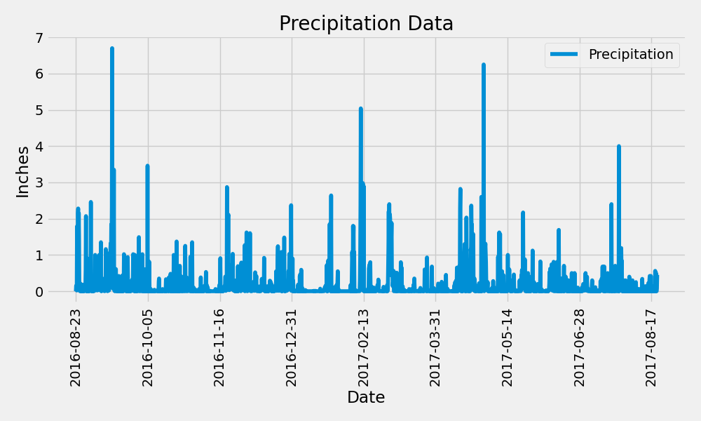
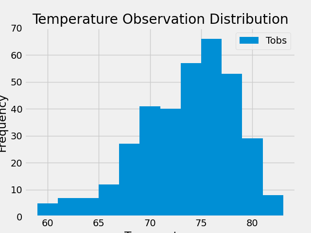

# sqlalchemy_challenge
This challenge provides a climate analysis of Honolulu, Hawaii, aiding in trip planning, and offers a climate app design for personalized weather updates and recommendations.

### Instructions
I've decided to treat myself to a long holiday vacation in Honolulu, Hawaii. To help with my trip planning, I choose to do a climate analysis of the area. I have included the following sections that outline the steps that I need to take to accomplish this task.

### Part 1: Analyze and Explore the Climate Data
In this section, I’ll use Python and SQLAlchemy to do a basic climate analysis and data exploration of my climate database. Specifically, I’ll use SQLAlchemy ORM queries, Pandas, and Matplotlib. 
To do so, I'll complete the following steps:

1: I'll use  (climate_starter.ipynb and hawaii.sqlite) files to complete my climate analysis and data exploration.

2: I'll use the SQLAlchemy create_engine() function to connect to my SQLite database.

3: I'll use the SQLAlchemy automap_base() function to reflect my tables into classes, and then save references to the classes named station and measurement.

4: Link Python to the database by creating a SQLAlchemy session.

**Note**
 It is important to close the session at the end of the notebook.

 5: Then, I'll perform a precipitation analysis and then a station analysis by completing the steps in the following two subsections.

 ####  Precipitation Analysis

 1: I'll find the most recent date in the dataset.
 
 2: Using that date, get the previous 12 months of precipitation data by querying the previous 12 months of data.
 
 3: Select only the "date" and "prcp" values.
 
 4: Load the query results into a Pandas DataFrame. Explicitly set the column names.
 
 5: Sort the DataFrame values by "date".
 
 6: Plot the results by using the DataFrame plot method, as the following image shows:

 

 7: Then, I'll use Pandas to print the summary statistics for the precipitation data.

 #### Station Analysis

 1: Design a query to calculate the total number of stations in the dataset.
 
 2: Design a query to find the most-active stations (that is, the stations that have the most rows). 
 
 To do so, I'll complete the following steps:
  - List the stations and observation counts in descending order.
  - I'll answer the following question: which station id has the greatest number of observations?
    
 3: Design a query that calculates the lowest, highest, and average temperatures that filter on the most-active station id found in the previous query.
 
 4: Design a query to get the previous 12 months of temperature observation (TOBS) data. 
 
 To do so, I'll complete the following steps:
 
     - Filter by the station that has the greatest number of observations.
     - Query the previous 12 months of TOBS data for that station.
     - Plot the results as a histogram with bins=12, as the following image shows:
     

5: Close session.

### Part 2: Design Climate App
Now that I’ve completed my initial analysis, I’ll design a Flask API based on the queries that I just developed. 
To do so, I'll use Flask to create my routes as follows:

1: /
  - Start at the homepage.
  - List all the available routes.
    
2: /api/v1.0/precipitation
  - Convert the query results from my precipitation analysis (i.e. retrieve only the last 12 months of data) to a dictionary using date as the key and prcp as the value.
  - Return the JSON representation of your dictionary.

3: /api/v1.0/stations
  - Return a JSON list of stations from the dataset.

4: /api/v1.0/tobs
  - Query the dates and temperature observations of the most-active station for the previous year of data.
  - Return a JSON list of temperature observations for the previous year.

5: /api/v1.0/<start> and /api/v1.0/<start>/<end>
  - Return a JSON list of the minimum temperature, the average temperature, and the maximum temperature for a specified start or start-end range.
  - For a specified start, calculate TMIN, TAVG, and TMAX for all the dates greater than or equal to the start date.
  - For a specified start date and end date, calculate TMIN, TAVG, and TMAX for the dates from the start date to the end date, inclusive.

**Hints**
- Join the station and measurement tables for some of the queries.
- Use the Flask jsonify function to convert my API data to a valid JSON response object.

**References**
Menne, M.J., I. Durre, R.S. Vose, B.E. Gleason, and T.G. Houston, 2012: An overview of the Global Historical Climatology Network-Daily Database. Journal of Atmospheric and Oceanic Technology, 29, 897-910, https://journals.ametsoc.org/view/journals/atot/29/7/jtech-d-11-00103_1.xmlLinks to an external site.
